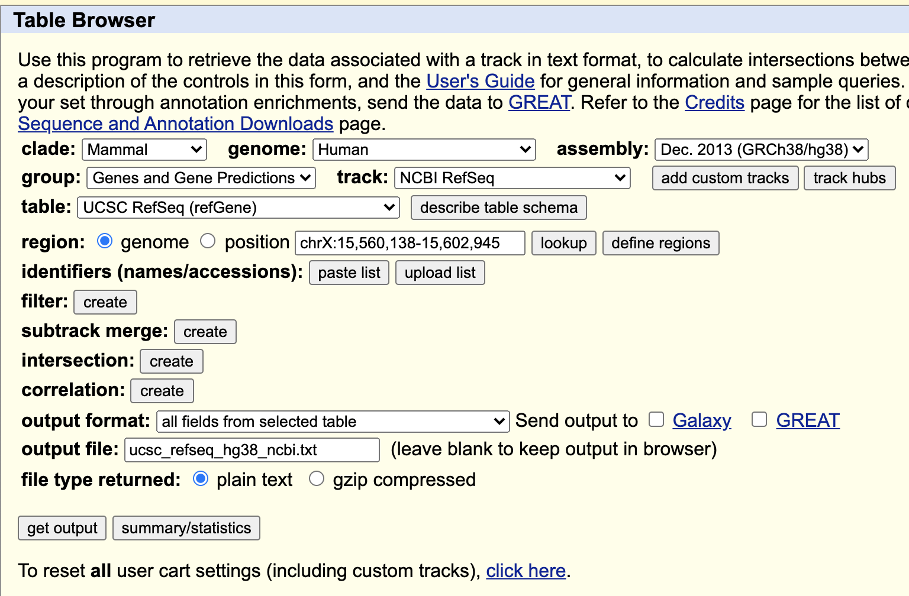

# TSS enrichment score calculation
ATAC-seq data Transcript Start Site (TSS) enrichment score calculation.

## Step0: Preparing reference files.
We are using the TSS from the UCSC Refseq annotation, hg19 for example.
The procedures of this step can be found at [this nice post](https://randomstate.net/2018-06-28-getting-refseq-gene-tss-from-ucsc/). (Seems it's a disrupted link)
The annotation table can be downloaded from [UCSC Table Browser](https://genome-euro.ucsc.edu/cgi-bin/hgTables).

Assuming the downloaded annotation file, *reference.txt*, is ready, which should include columns in the following order:

|bin	|name	|chrom	|strand	|txStart	|txEnd	|cdsStart	|cdsEnd	|exonCount	|exonStarts	|exonEnds	|score	|name2	|cdsStartStat	|cdsEndStat	|exonFrames|
--- | --- | --- | --- | --- | --- | --- | --- | --- | --- | --- | --- | --- | --- | --- | --- |

Run the following command:

`./getTSS.sh reference.txt`

It generated three files *reference.txt.TSS.bed, reference.txt.TSS.unique.bed, and reference.txt.TSS.unique.2K.bed*.
Only *reference.txt.TSS.unique.2K.bed* will be used in the following steps.

## Step1: Get read coverage of your bam files.

In this step, we can get the read coverage on the genome coordinates.
Prepare your bam file, *mybam.bam* in advance.

Run the following command:

`./getCov1.sh mybam.bam reference.txt.TSS.unique.2K.bed`

After it finishes, run the following command:

`./getCov2.sh mybam.bam reference.txt.TSS.unique.2K.bed`

You will get *mybam.bam.sel.bam*, which is the bam file with reads in your TSS flank regions, and *mybam.bam.sel.bam.gc*, which is the genome coverage file.

## Step2: Format the genome coverage file to matrix.

In this step, we will format the genome coverage profile to a N * 2001 matrix, where N is the number of TSS covered in your data.

Run the following command:

`./formatTSS.sh reference.txt.TSS.unique.2K.bed mybam.bam.sel.bam.gc`

This step will generate the matrix file, *mybam.bam.sel.bam.gc.TSSmat.txt*

## Step3: Calculate the TSS score.

In this step, we are calculating the TSS score based on the matrix from the previous step.

Run the command in this way:

`./calTSS.sh mybam.bam.sel.bam.gc.TSSmat.txt 50 100 5`

You can adjust the parameters (50, 100, 5) in the command line above, and you can refer to a [nice post here](https://divingintogeneticsandgenomics.rbind.io/post/calculate-scatacseq-tss-enrichment-score/).

Then you will get the TSS enrichment score printed out. 
Hope you can get one above 5!
**Cheers!!!**

## Reference:
[Calculate scATACseq TSS enrichment score](https://divingintogeneticsandgenomics.rbind.io/post/calculate-scatacseq-tss-enrichment-score/)

[Getting RefSeq gene TSS from UCSC](https://randomstate.net/2018-06-28-getting-refseq-gene-tss-from-ucsc/)

[Bedtools](https://bedtools.readthedocs.io/en/latest/)

